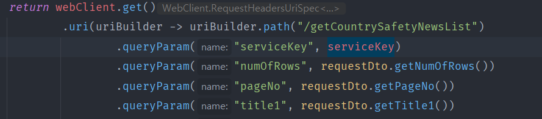
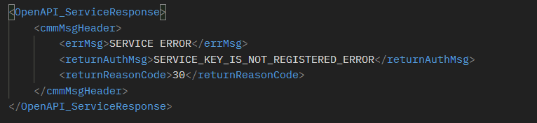
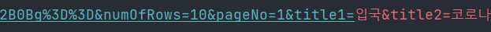
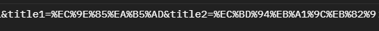
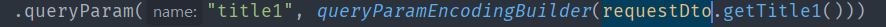

Spring WebClient로 Get으로 API를 요청시 QueryParam으로 데이터를 넘겨주게 되는데
이때 WebClient는 전달되는 QueryParam의 데이터를 인코딩하게 되는데 API 명세와 다르게 데이터가 넘어가 이슈가 발생한다.
 

GET으로 API를 위처럼 QueryParam으로 전달하는 모든 Value 값이
임의로 인코딩되어 요청을 받은 서버에서는 Error나 잘 못된 정보라고 아래 처럼 응답이 올 것이다.



원인은 Api 요청시 식별자 역할을 하는 API key인 serviceKey 값이 WebClient가 임의로 인코딩하여 전달하면서 
달라진 키값으로 요청하기 때문이다.


98은 정상적인 서비스키의 length이고 107은 Webclient 요청시 전달된 서비스키의 length이다. 
이렇게 달라져 버린 키로 인해 정상적인 API를 요청할 수 없다.

이 이슈의 해결법은 간단하다.

```Java
 DefaultUriBuilderFactory builderFactory = new DefaultUriBuilderFactory(API_URL);
 builderFactory.setEncodingMode(DefaultUriBuilderFactory.EncodingMode.VALUES_ONLY);
      
 WebClient client = WebClient
        .builder()
        .uriBuilderFactory(builderFactory)
        .baseUrl(API_URL)
        .clientConnector(new ReactorClientHttpConnector(HttpClient.from(tcpClient)))
        .build();
```

WebClient 설정값을 변경해주면 된다. EncodingMode의 기본값은  "EncodingMode.URI_COMPONENT" 인데
"EncodingMode.VALUES_ONLY" 로 설정해 주면 QueryParam으로 넘어가는 데이터의 값이 인코딩 되지 않고 전달하려는 값 그대로 
전달할 수 있다.

영어, 숫자, 특수문자로 QueryParam을 전달하는 경우에는 위의 방법으로 대부분은 해결이 될 것이다. 
하지만 **한글 등 다른 외국어** 를 QueryParam으로 전달할 경우 아직 이슈가 남아있다.


위 이미지를 보면 key, numOfRows, pageNo 파라미터는 넘겨준 값이 제대로 전달이 되는데 한글 파라미터를 넘겨줘야 하는
title1~2의 경우 한국어가 그대로 넘겨주면서 이슈가 발생한다.


이 캡처는 포스트맨으로 같은 API를 요청해 본 것인데 한국어를 전달시에는 한국어가 인코딩되어 전달되어야 한다.

####QueryParam에서 "title1=입국"은  "title=%EC%9E%85%EA%B5%AD&" 형식으로 전달이 되어야 Api가 제대로 전달되는 것이다.

```Java
DefaultUriBuilderFactory.EncodingMode.URI_COMPONENT
```
이를 WebClient에서 해결하기 위해서는 EncodingMode를 다시 기본값 인 "URI_COMPONENT" 로 변경시 한국어 파라미터는 인코딩되어 제대로 넘어가지만,
servicekey 변환 문제가 남아있어 webClient에서 해결이 아닌 다른 방법을 찾아야했다.

```Java
private static String queryParamEncodingBuilder(String title) {
    return UriComponentsBuilder.fromUri(URI.create(title)).encode().toUriString();
}
```



Spring Web에서 제공하는 API인  UriComponentsBuilder를 이용해 해당 QueryParam 부분에 위의 메서드를 적용해
"title1=입국"을 "title=%EC%9E%85%EA%B5%AD&" 인코딩한 값으로 넘겨주는 형태로 구현했다.

Spring WebClient 예제가 국내에 별로 없어 이 문제 해결에 삽질을 좀 했다. 한국어를 파라미터로 넘겨주는 경우가 생소해서 정보가 없던거 같은데
공공 API를 사용하다보니 해당 이슈를 찾게 되었다..